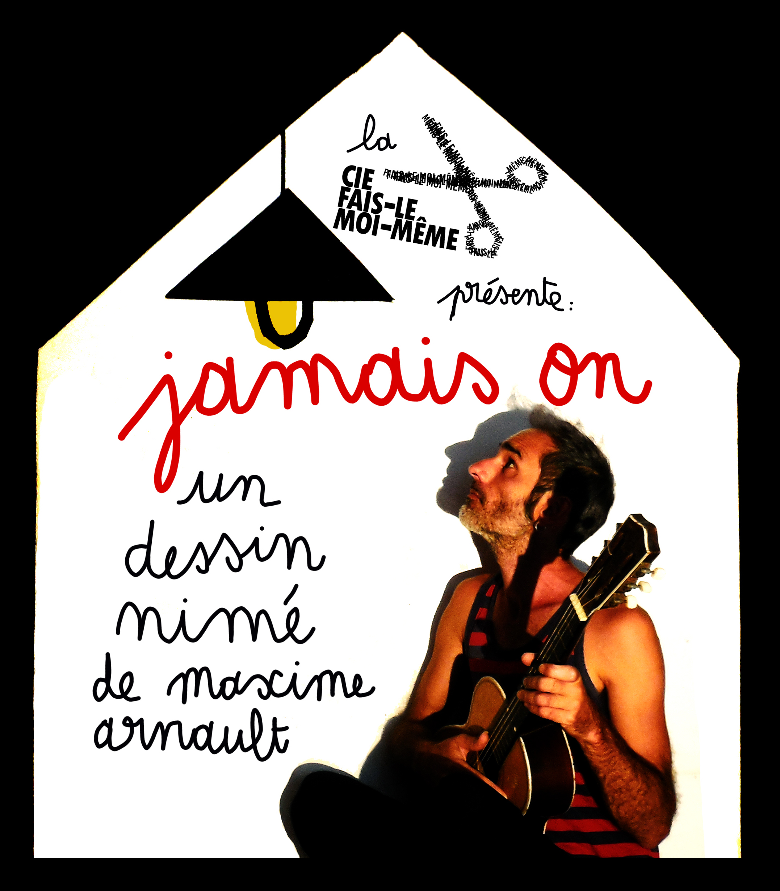
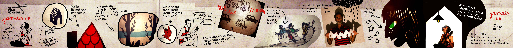

Création 2023

A travers ce deuxième spectacle de la Cie Fais-Le Moi-Même, Maxime Arnault continue d’interroger son thème de prédilection, la maison.  
Avec ce “dessin nimé” musical, pop et gribouillé, Maxime, tour à tour, dessinateur, chanteur, marionnettiste ou bricoleur, prouve qu’avec trois bouts de ficelle il est possible de créer des images fortes et poétiques.  
_Jamais On_ ravira, entre autres, les amateurs de rétroprojecteur, de papier découpé, des Beatles, de ciel étoilé, de cassette audio, de pop japonaise et d’Evelyne Dhéliat.

<iframe width="1079" height="607" src="https://www.youtube.com/embed/lzuxqsYO7dI" title="Jamais On - Cie Fais-Le Moi-Même - Teaser" frameborder="0" allow="accelerometer; autoplay; clipboard-write; encrypted-media; gyroscope; picture-in-picture; web-share" allowfullscreen></iframe>

A partir de 3 ans  
Durée : 30 min  
Spectacle en intérieur, autonome techniquement.  
Besoin d’obscurité et d’électricité.  

 