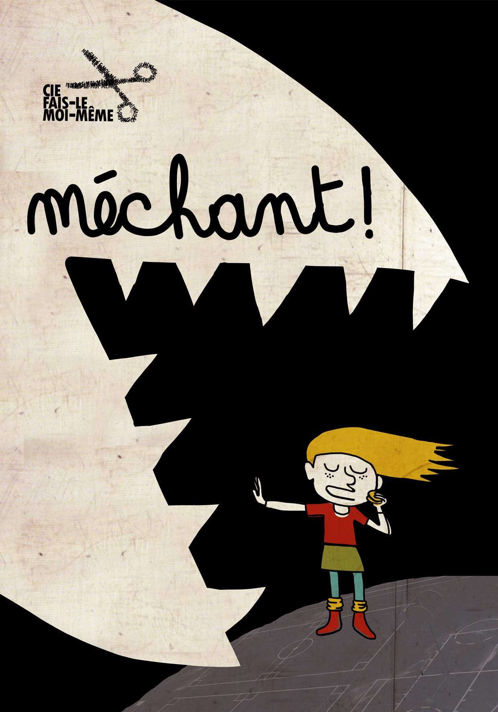

## *Un spectacle gentil mais faut pas trop le chercher*

jeune public - à partir de 4 ans  
durée : environ 35 minutes

Croch’patte a faim, ça le rend méchant. Alors il se prend pour un loup pour voler les goûters des petits.  
Biquette est menue mais elle est prête à en découdre.  
Parce qu’ils sont copains (et parce qu’elle tient à son goûter), elle va pas laisser Croch’patte tout seul avec sa méchanceté.  

Cette pièce drôle et rythmée, questionne la façon dont on construit notre rapport aux autres, la violence, mais aussi l’amitié.  
Anne Sylvestre, comme d’habitude, prend les enfants au sérieux. Et ça ne l’empêche pas d’être légère. Mais ça permet aux enfants de voir comment déjouer la rudesse de leurs rapports dans la cour d’école. Elle propose aux petites filles une façon de se défendre, une place pour y exister et aux petits garçons un peu de douceur pour se faire entendre.  

Texte : Anne Sylvestre  
Avec Chloé Thorey et Benoit Boutry  
Regard complice : Amandine Watremez 